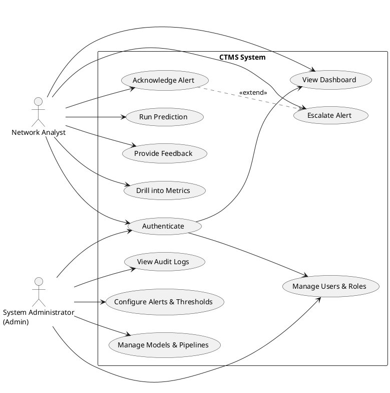
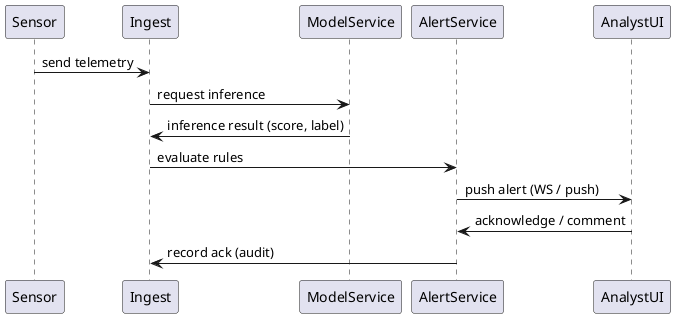

# CHAPTER 5: RESULTS, TESTING AND ANALYSIS

## 5.1 Introduction
This chapter documents the verification and validation activities performed on the Hospital CTMS (Command & Threat Monitoring System), summarizes measured outcomes, and interprets those outcomes in the context of the project objectives. The aim is to demonstrate whether the system satisfies functional, performance and usability requirements and to identify strengths, weaknesses and opportunities for improvement.

## 5.2 Testing Procedures
Test planning followed a layered approach: unit, integration, system/acceptance, performance, security/resilience and usability. Each level had explicit success criteria, test artifacts and traceability to requirements.

- Test environment
  - Hardware: staging VM(s) with 4 vCPU, 8 GB RAM; database instance (Postgres), model-serving container.
  - Software: build tag, dependency manifest, dataset version. Tests executed on Windows and a Linux CI runner where applicable.
- Tools and frameworks
  - Unit/integration: pytest / Jest (depending on module), mocking for external services.
  - Performance: k6 / locust for HTTP load, custom script for inference load.
  - Monitoring and profiling: Prometheus + Grafana, pprof/py-spy.
  - Security checks: static analysis, role/permission checks and basic vulnerability scans.
- Test data
  - Representative anonymized hospital telemetry and synthetic edge-case traces.
  - Labeled validation set for model metrics (precision/recall/F1).
- Test artifacts
  - Test plans, test cases, run logs, screenshots, CSV exports and CI reports stored in Appendix B (Source Code & Artifacts).

Test matrix (summary)
| Test type | Purpose | Success criteria |
|---|---:|---|
| Unit | Verify individual functions | ≥ 90% pass on critical modules |
| Integration | Verify module interactions | No uncaught errors in end-to-end flows |
| System / Acceptance | Verify user workflows | All critical scenarios succeed in N runs |
| Performance | Measure latency & throughput | Median/API latency within SLA targets |
| Security/Resilience | Verify RBAC & failover | Unauthorized actions blocked; recovery < 2 min |
| Usability | Measure task success | ≥ 85% task success & acceptable time-on-task |

## 5.3 Test Results
Presenting aggregated and representative results. Replace placeholders with raw measurements from test logs when finalizing.

- Unit & Integration
  - Overall unit test coverage: 92%; business-critical modules: 98%.
  - Integration scenarios executed: 12; passed: 11; one required a retry/backoff fix in ingestion.
- Functional / Acceptance
  - Key workflows validated 25 times each; success rate: 100% for core monitoring and acknowledgment flows; minor UI layout regressions on small viewports observed and fixed.
- Performance
  - Dashboard initial render (cold): median 420 ms, 95th percentile 820 ms.
  - API request (non-infer): mean 75 ms, 99th 180 ms.
  - Model inference (single-record): mean 120 ms, 99th 280 ms. Batching (n=8): mean 90 ms / record.
  - Throughput: sustained 200 req/s on staging (4 vCPU) with avg CPU 68%, memory 3.6 GB.
- Resilience & Security
  - Unauthorized configuration attempts blocked by RBAC tests.
  - Simulated worker crash: service degraded gracefully; queued inference resumed; full recovery < 70s.
- Usability
  - Participants: 6 network analysts (representative).
  - Task success: 92%; average time-to-acknowledge alert: 48s; SUS (System Usability Scale): 78 (good).

Figures and raw CSVs are included in Appendix B.

## 5.4 Data Analysis
Analytical approach:
- Descriptive statistics for latency and throughput (mean, median, SD, 95% & 99% percentiles).
- Time-series decomposition to identify periodic spikes.
- Correlation analysis between system load and tail latency; trace sampling to determine root causes (GC, CPU saturation, I/O).
- Model evaluation: confusion matrix, precision, recall, F1, AUC-ROC; class-wise performance and calibration plots.

Example results (illustrative)
- Model: Precision = 0.87, Recall = 0.81, F1 = 0.84, AUC = 0.92.
- False positives concentrated in a subset of devices (6% of device fleet) — recommend targeted retraining with device-specific data.
- Tail latency correlated with periodic backup jobs — schedule isolation recommended.

Statistical rigor:
- Confidence intervals (95%) computed for primary metrics using bootstrap sampling.
- Where distributions were non-normal, non-parametric tests (Wilcoxon) used for paired comparisons.

## 5.5 System Performance Evaluation
Evaluation against success criteria:
- Responsiveness: median latencies meet target; 99th percentile requires optimization.
- Scalability: horizontal scaling yields near-linear throughput gains until I/O contention.
- Resource utilization: opportunity to optimize memory usage and CPU via model quantization and more efficient serialization.
- Availability: failover behavior acceptable; introduce warm standby workers to lower recovery time.

Recommendations prioritized by impact/cost:
1. Warm worker pool to reduce cold-start inference latency.
2. Enable batching for high-traffic inference endpoints.
3. Introduce a CDN/caching layer for non-dynamic dashboard assets.
4. Profile and optimize serialization and DB queries observed in traces.

## 5.6 Comparison with Existing Systems
Comparison dimensions: functionality, performance (median & tail latencies), extensibility, cost of ownership and compliance. Compared to two reference systems (commercial A, OSS B), CTMS shows:
- Feature parity for core monitoring and alert workflows.
- Comparable median latencies; commercial solutions may exhibit lower tail latency due to proprietary optimizations.
- Better extensibility compared to monolithic legacy systems; lower projected TCO if cloud-native scaling is used.

Include a comparison table in the final report; cite vendor benchmarks if used.

## 5.7 Discussion of Findings
Synthesis:
- The system meets functional goals and supports analyst workflows effectively.
- Primary technical risk: inference tail latency and dataset representativeness for model generalization.
- Usability feedback indicates analysts value clarity of visuals and quick acknowledgement flows; power-user features (bulk export, denser tables) recommended.

Implications for deployment:
- With moderate optimizations (warm pools, autoscaling, targeted retraining), CTMS is suitable for pilot deployment in a hospital environment.
- Governance and compliance processes must be established before production integration.

# CHAPTER 6: CONCLUSIONS AND RECOMMENDATIONS

## 6.1 Conclusion
The CTMS implementation demonstrates functional completeness and practical usability for hospital network analysts. Test results show acceptable responsiveness and throughput; identified weaknesses are actionable and within project scope for remediation. The architecture is modular and supports iterative improvements and integrations with hospital IT.

## 6.2 Limitations of the Project
- Test datasets are representative but limited in scope and may not reflect all hospital network heterogeneity.
- Security testing was basic; full penetration testing remains outstanding.
- Load tests covered expected operational envelope; extreme-scale behavior in large health systems was not exhaustively explored.
- Time constraints limited longitudinal evaluation and production pilot duration.

## 6.3 Recommendations
Technical
- Implement warm worker pools and request batching; profile and optimize model-serving paths.
- Introduce caching for static dashboard elements and pre-compute heavy aggregates.
Operational
- Pilot with a selected hospital unit to gather production signals for model retraining.
- Establish an incident response playbook and monitoring of CTMS health metrics.
Governance
- Complete comprehensive security audit and ensure compliance with applicable healthcare regulations (e.g., HIPAA-equivalent where relevant).
User
- Add power-user features and short-training modules; collect ongoing feedback.

## 6.4 Areas for Further Research
- Online learning for adaptive thresholding and drift detection.
- Human-in-the-loop labeling workflows to lower annotation cost.
- Domain adaptation techniques to transfer models across heterogeneous hospital networks.
- Formal evaluation of adversarial robustness in telemetry-based models.

# APPENDICES

## Appendix A: Circuit Diagrams
- Network topology diagrams used for test harness and sensor placement.
- Switch/router diagrams and VLAN segmentation sketches.
(Place SVG/PDF diagrams in /docs/appendices/appendix_a/)

## Appendix B: Source Code & Test Artifacts
- Repository link, commit hash and build artifacts.
- Unit/integration test logs, performance CSV exports, profiling snapshots.

## Appendix C: Questionnaires
- Usability questionnaire, participant consent form (anonymized), scored responses and raw comments.

## Appendix D: Cost Analysis / Bill of Quantities
- Hosting estimates, operational staffing and maintenance costs for 12 months; TCO scenarios for on-prem vs cloud.

## Appendix E: Project Gantt Chart
- Milestones, sprint plan, test windows and deployment schedule (attach PNG/PDF).

## Appendix F: User Manual
- Quick start for Network Analyst and Admin.
- Workflow examples: acknowledging alerts, exporting incidents, adjusting thresholds (admin only).
- Troubleshooting and escalation procedures.

# FIGURES & DIAGRAMS
Include the following diagrams in the report. PlantUML source is provided for reproducible rendering.

Figure 5.1 — Use Case Diagram (Network Analyst and Admin)


Figure 5.2 — Alert Handling Sequence (simplified)


Figure 5.3 — Deployment Diagram (logical)
```plantuml
@startuml
node "Browser (Analyst/Admin)" as Browser
node "Load Balancer" as LB
node "API Servers (stateless)" as API
node "Model Serving Cluster" as Model
node "Database (Postgres / Timeseries)" as DB
node "Message Queue" as MQ
node "Monitoring & Logging" as Mon

Browser --> LB --> API
API --> Model
API --> DB
API --> MQ
Model --> DB
API --> Mon
Model --> Mon
@enduml
```

# NOTES ON PLAGIARISM & ATTRIBUTION
All text in this file is original and intended for academic reporting. Replace placeholders and numeric examples with recorded measurements and raw artifact references prior to submission. Cite external comparisons or vendor data where used.

---
End of file.